# 🧾 Vacation Tracking System (VTS)

A complete web-based system for managing employee vacation and leave requests — developed as part of the **Object-Oriented Analysis and Design (OOAD)** coursework.

---

## 🧩 Overview
The **Vacation Tracking System (VTS)** automates the process of requesting, approving, and tracking employee vacations.
It minimizes manual HR workload and ensures accurate, transparent, and rules-based vacation management.

---

## 📘 UML Diagrams

### 1️⃣ Use Case Diagrams
> Represent the **functional requirements** and main **interactions between actors** (Employee, Manager, HR) and the system.

- 
- 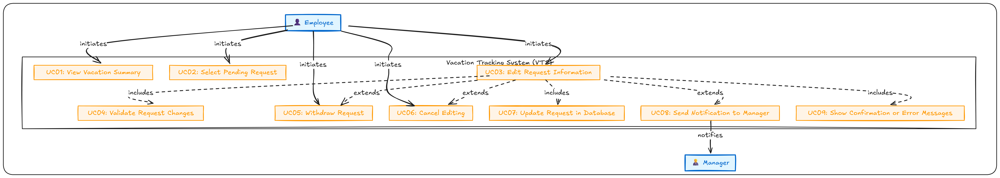
- 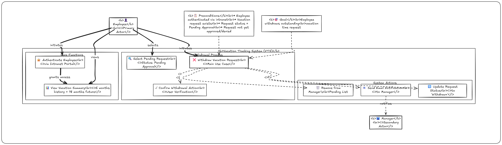
- 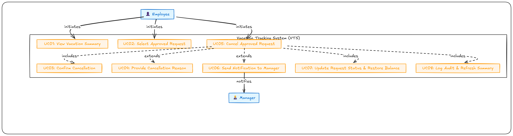

---

### 2️⃣ Flowcharts
> Show the **step-by-step logical flow** for each process including decision points, validation, and system feedback.

- 
- 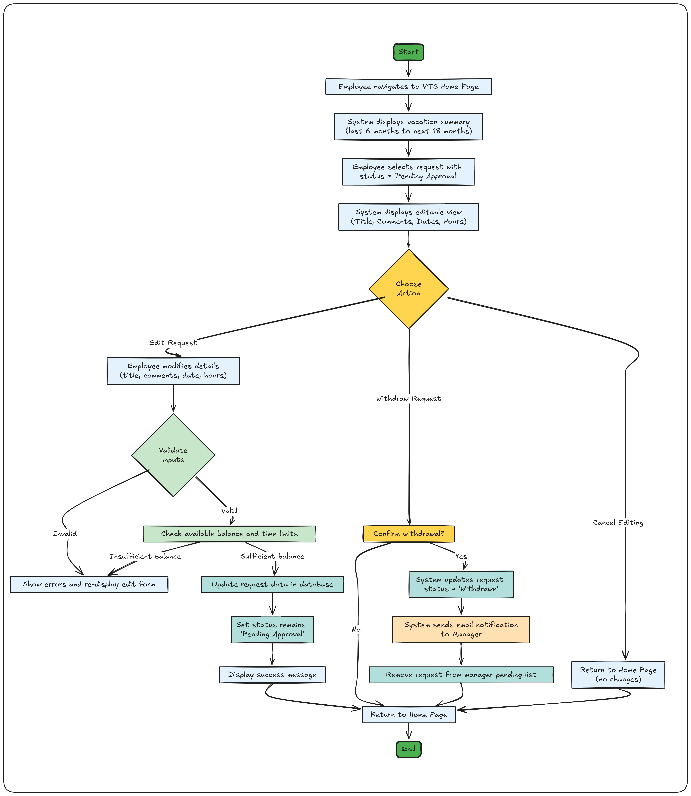
- 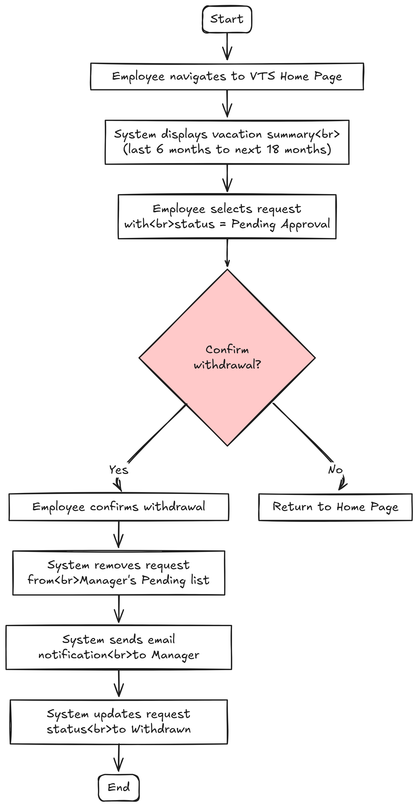
- 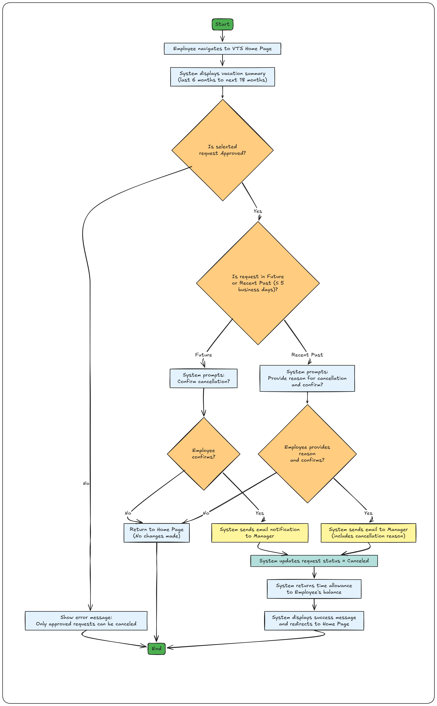

---

### 3️⃣ Sequence Diagrams
> Illustrate **how messages are exchanged** between components (Employee, System, Manager, HR) in chronological order.

- 
- 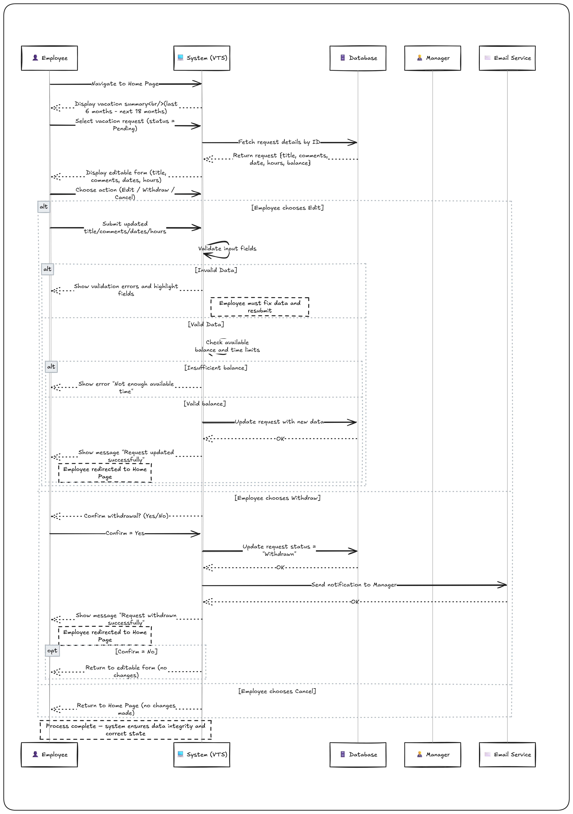
- 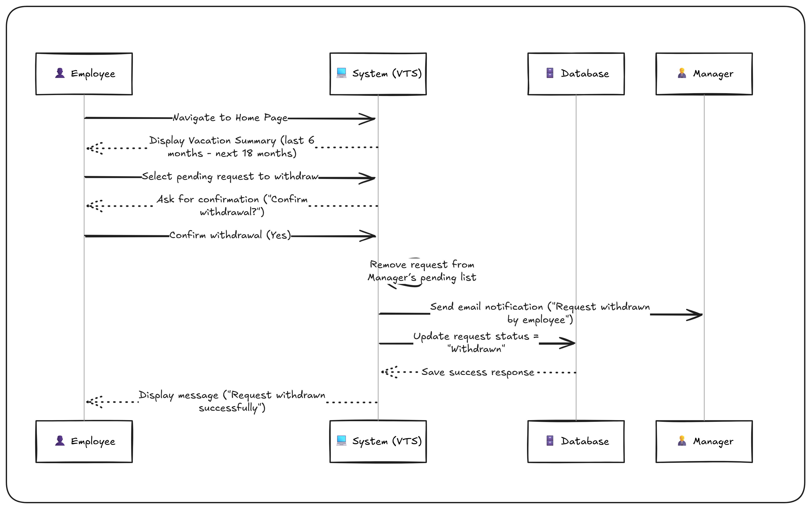
- 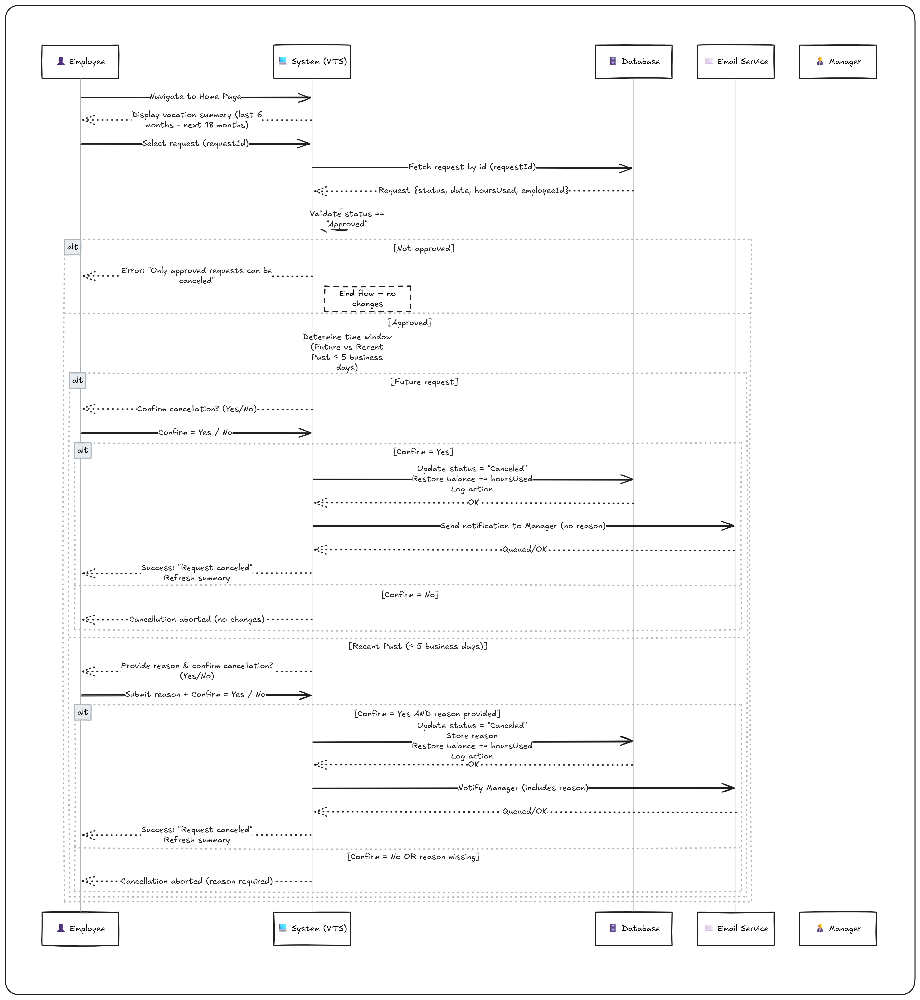

---

### 4️⃣ Class Diagram
> Defines the **system structure**, showing relationships between classes like `Employee`, `Manager`, and services like `EmailService`.

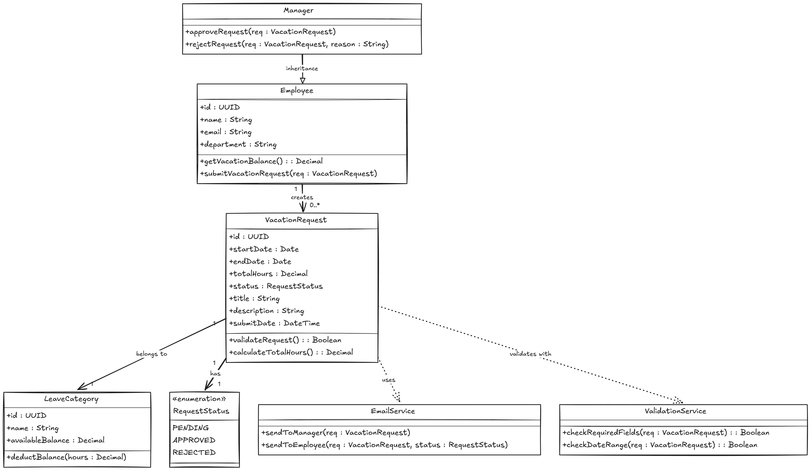

---

### 5️⃣ Entity Relationship Diagram (ERD)
> Represents the **database schema**, including tables, attributes, and relationships between entities.

---

### 6️⃣ State Machine Diagram
> Shows the **different states** a vacation request goes through (Created → Pending → Approved → HR Pending → HR Approved → Completed/Rejected/Withdrawn/Canceled).

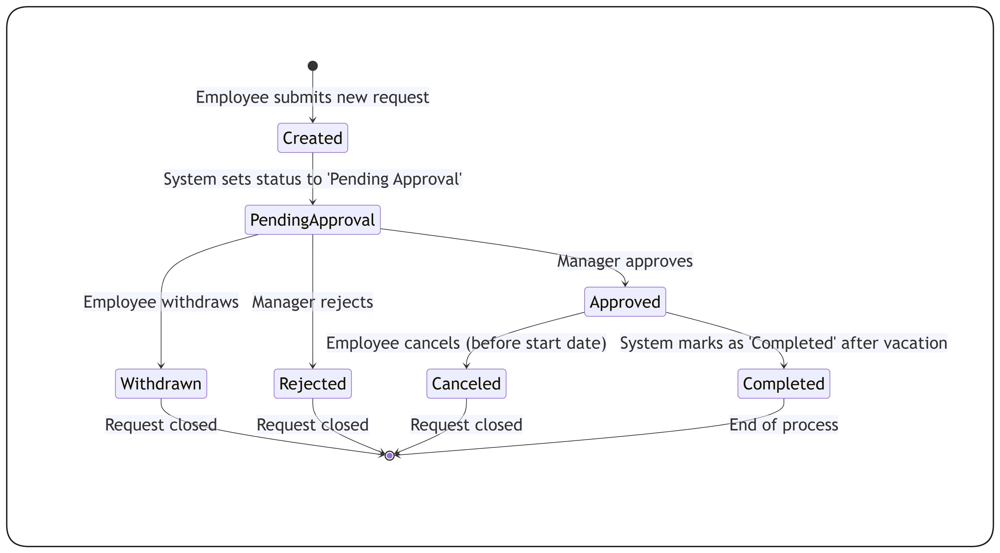

---

## 🧭 HR Approval Scenario
> Explains how HR interacts with the system once the manager approves a request.
> This ensures compliance, checks employee balance, and prevents overlap between team members’ vacations.

📄 [View HR Approval Process](./docs/hr_approval.md)

---

## 🧱 UI Layouts

### 👤 Employee Interface
> The employee dashboard allows users to create, view, edit, and withdraw requests.
> It displays vacation balances, dates, and current statuses for transparency.

📄 [Employee UI Design](./ui/employee-ui.md)

---

### 🧑‍💼 Manager Interface
> The manager dashboard provides a summarized view of pending requests, with quick actions like Approve, Reject, Forward to HR, and Comment.

📄 [Manager UI Design](./ui/manager-ui.md)

---

## 🗂️ Documentation

| Category | File | Description |
|-----------|------|-------------|
| 🧾 Requirements | [Requirements.md](./docs/Requirements.md) | System goals, functional & non-functional requirements |
| ⚙️ Pseudocode | [Create](./pseudocode/create.md) – [Edit](./pseudocode/edit.md) – [Withdraw](./pseudocode/withdraw.md) – [Cancel](./pseudocode/cancel.md) | Step-by-step pseudocode for each major flow |
| 🧭 HR Scenario | [HR Approval](./docs/hr_approval.md) | Describes the HR-level approval process |
| 🧠 State Machine | [state-machine.png](./docs/state-machine.png) | State transition visualization |
| 🧩 UI Mockups | [Employee UI](./ui/employee-ui.md) & [Manager UI](./ui/manager-ui.md) | Interface sketches for both roles |

---

## ⚙️ Technologies & Tools
| Type | Tool / Platform |
|------|-----------------|
| **Design & Diagrams** | [Excalidraw](https://excalidraw.com), Draw.io |
| **Documentation** | Markdown (`.md`) |
| **Version Control** | Git & GitHub |
| **Modeling Standard** | UML 2.0 & OOAD Principles |

---

## 🧠 System Highlights
- ✅ Fully modular and structured (flows, pseudocode, sequences, use cases)
- 🧩 Clear separation between **Employee**, **Manager**, and **HR** layers
- 🧠 Based on **Object-Oriented Analysis & Design (OOAD)** best practices
- 📈 Scalable — supports adding new approval stages like `HR_Approval` or `Finance_Check`
- 🧾 Consistent naming and unified design for professional readability

---

## 👨‍💻 Author
**Ahmed Hany**
_Object-Oriented Analysis and Design Project_
Faculty of Computers and Artificial Intelligence – Cairo University

---

⭐ **If you find this project helpful, please give it a star on GitHub!**
