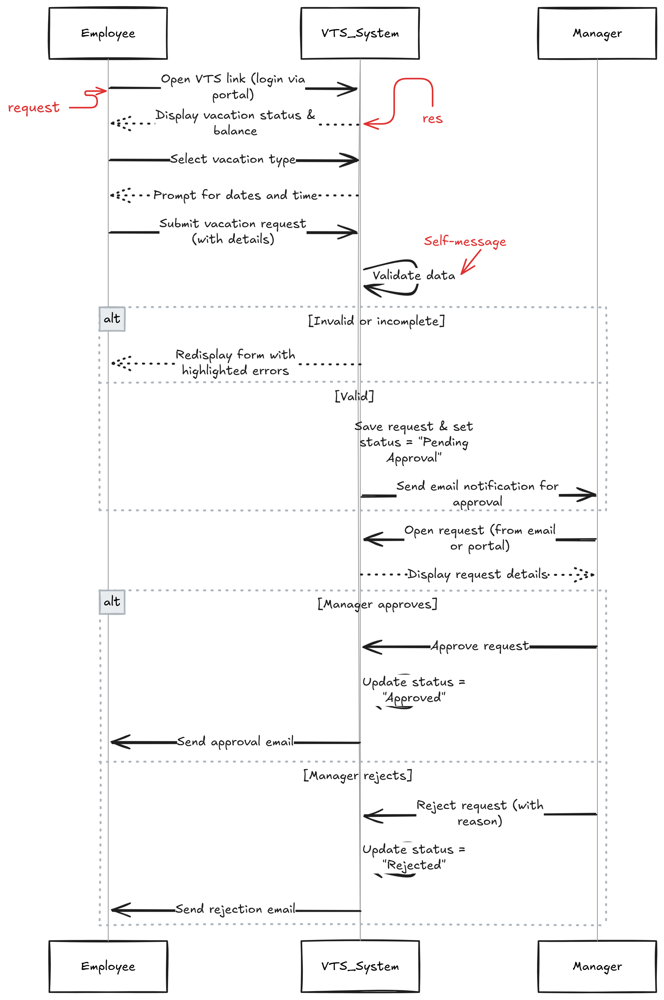
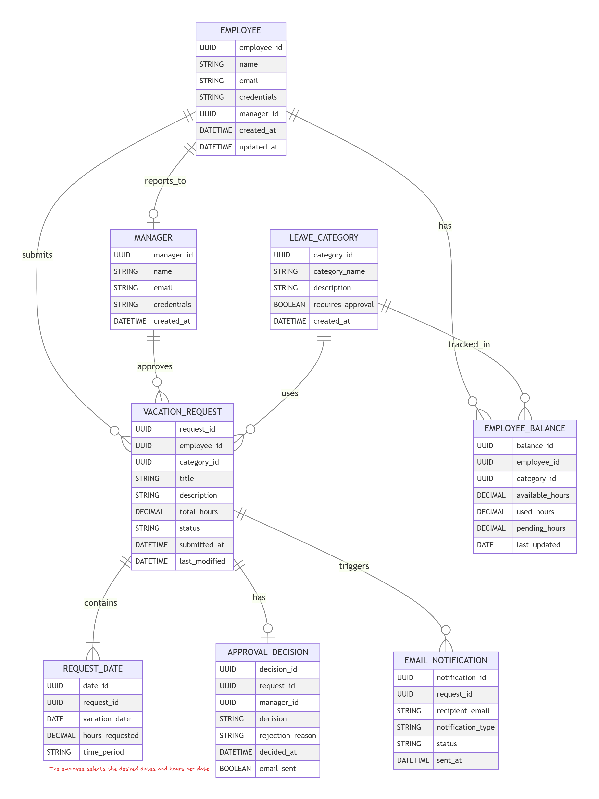

# 🧾 Vacation Tracking System (VTS)

A simple web-based system for managing employee vacation requests — built as part of the **Object-Oriented Analysis and Design (OOAD)** coursework.

---

## 📘 UML Diagrams

### 1️⃣ Use Case Diagram

### 2️⃣ Flowchart Diagram

### 3️⃣ Sequence Diagram

### 4️⃣ Class Diagram

### 5️⃣ Entity Relationship Diagram (ERD)

---

## 🧩 Description
The **Vacation Tracking System (VTS)** allows employees to submit vacation requests, and managers to approve or reject them.
It applies OOAD concepts through UML diagrams to represent structure and behavior.

**Main Features:**
- Employee & Manager roles
- Vacation balance tracking
- Request validation
- Email notifications
- Database design and relationships

---

## 🧱 Technologies & Tools
- **Design Tools:** Draw.io, Lucidchart, Mermaid
- **Documentation:** Markdown (README.md)
- **Version Control:** Git & GitHub

---
