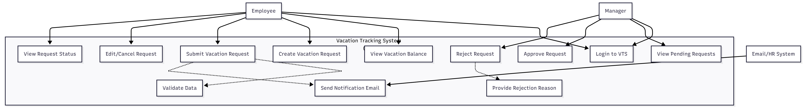

# 🧾 Vacation Tracking System (VTS)

A simple web-based system for managing employee vacation and leave requests — built as part of the **Object-Oriented Analysis and Design (OOAD)** coursework.

---

## 📘 UML Diagrams

### 1️⃣ Use Case Diagram

### 2️⃣ Flowchart Diagram

### 3️⃣ Sequence Diagram

### 4️⃣ Class Diagram

### 5️⃣ Entity Relationship Diagram (ERD)

---

## 📄 Project Documentation

- 📘 [Requirements Document](./docs/Requirements.md)
- 💻 [Pseudocode Document](./docs/Pseudocode.md)

---

## 🧩 Description

The **Vacation Tracking System (VTS)** allows employees to submit vacation requests while enabling managers to approve or reject them efficiently.
It applies Object-Oriented Analysis and Design (OOAD) principles through UML diagrams that represent both system **structure** and **behavior**.

### 🔹 Main Features
- Employee & Manager roles
- Vacation balance tracking
- Request validation
- Email notifications
- Activity logging
- Integration with HR legacy systems

---

## 🧱 Technologies & Tools
- **Design Tools:** https://excalidraw.com/
- **Documentation:** Markdown (`.md`)
- **Version Control:** Git & GitHub

---

## 👤 Author
**Ahmed Hany**
_Object-Oriented Analysis and Design Project_

---

⭐ *If you find this project helpful, don’t forget to star the repository!*
